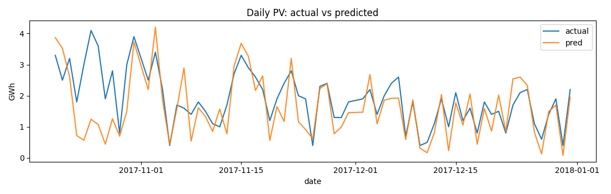
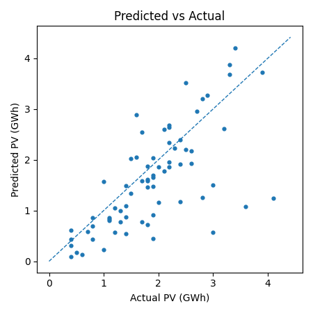

# 🌞 Solvion — NASA Space Apps Challenge 2025

**Project Name:** Solar Energy Solution  
**Team:** Solvion  
**Challenge:** #2 – Solar Energy  
**Location:** Switzerland 🇨🇭  
**Event:** NASA Space Apps Challenge 2025  

---

## 🚀 Goal
Develop a data-driven solution using **NASA datasets** and **APIs** to analyze and optimize the use of **solar energy** for sustainable development and clean power generation.

---

## 🧠 Idea
Our project focuses on:
- Using **NASA POWER API** and satellite data to estimate solar potential.
- Visualizing solar irradiation and weather conditions.
- Providing insights for energy planning and renewable solutions.

---

## 🛠️ Tech Stack
- **Languages:** Python
- **Libraries:** Pandas, Xarray, Matplotlib, Streamlit, PyTorch

    
## 📊 Data Sources

- 🌍 **NASA POWER Data Access** – Solar & meteorological data  
  🔗 https://power.larc.nasa.gov/  

- ☁️ **MeteoSwiss Open Data** – Hourly/daily weather observations & forecasts  
  🔗 https://opendata.swiss/de  

- 🌡 **MeteoSwiss API** – Real-time forecast weather data  
  🔗 https://opendata.swiss/de  

- 🌐 **Copernicus Climate Data Store** – Reanalysis, seasonal forecasts, ERA5 datasets  
  🔗 https://cds.climate.copernicus.eu/  

- ⚡ **Swissgrid Transparency Platform** – Load, production, and balancing data for Switzerland  
  🔗 https://www.swissgrid.ch/en/home/operation/grid-data/transparency.html  

- 🔧 **pvlib-python** – Solar power modeling based on weather forecasts  
  🔗 https://pvlib-python.readthedocs.io/  

---

## Project Setup

```
python3 -m venv venv
source venv/bin/activate
pip install -r requirements.txt
```

## 📂 Project Structure
```bash
.
├── dashboard/
│   └── app.py                         # Interactive dashboard (map + calendar) for PV prediction
│
├── data/
│   └── raw/                           # Raw input data
│       ├── ogd103_stromverbrauch_swissgrid_lv_und_endv.csv   # Energy consumption
│       └── ogd104_stromproduktion_swissgrid.csv              # PV production
│
├── LICENSE                            # MIT License
│
├── models/                            # Saved trained models and metadata
│   ├── national_consumption_gwh.joblib
│   ├── national_consumption_gwh.meta.json
│   ├── pv_production_gwh.joblib
│   └── pv_production_gwh.meta.json
│
├── notebook.ipynb                     # 🧠 **Main notebook — data, modeling, and results**
│
├── README.md                          # Project documentation
│
├── reports/                           # 📊 Model outputs, predictions, and evaluation plots
│   ├── national_consumption_gwh_predictions.csv
│   ├── national_consumption_gwh_pred_vs_actual.png
│   ├── PV_prediction_LSTM_v1.png
│   ├── PV_prediction_LSTM_v2.png
│   ├── pv_production_gwh_predictions.csv
│   └── pv_production_gwh_pred_vs_actual.png
│
├── requirements.txt                   # Python dependencies
│
├── scripts/                           # Utility scripts
│   ├── fetch_weather.py               # Fetch hourly weather data
│   ├── test_models.py                 # Evaluate saved models
│   └── train_models.py                # Train new models
│
├── SolvionPresentation.pptx           # 🎯 Presentation slides
│
└── src/                               # Core source code
    ├── model.py                       # Model definitions (MLP, LSTM, etc.)
    ├── train.py                       # Training pipeline
    └── weather_core.py                # Weather data handling and preprocessing
```

### 🗂️ Folder Summary

- **`notebook.ipynb`** – 🧠 **Main notebook for running all experiments** *(data → model → results)*.  
  Contains the **full workflow**: data loading, preprocessing, model training, and evaluation.

- **`data/raw/`** – Raw datasets (PV production, energy consumption).

- **`models/`** – Trained models and metadata files.

- **`reports/`** – Prediction CSVs and evaluation plots.

- **`scripts/`** – Standalone scripts for fetching data and training/testing models.

- **`src/`** – Core logic (model classes, training functions, data utilities).

- **`dashboard/`** – Interactive dashboard for region & date-based PV prediction.

## 🚀 How to Run the Notebook

To explore data, train models, and view results interactively, launch **Jupyter Notebook**:

```bash

# launch Jupyter
jupyter notebook.ipynb    # or jupyter-lab notebook.ipynb
```

# Models

## Weak Supervision Model (LSTM)

This model estimates **daily national PV production** using **hourly weather data** from multiple locations, without access to hourly PV labels.  
It learns by ensuring that the **sum of its hourly predictions** matches the **observed daily PV total**.

### Approach

- Each training sample represents a **(location, hour)** pair.  
- The input is a **sequence** of weather features from the **previous _n_ hours**  
  (e.g. radiation, temperature, humidity, wind, etc.).  
- A **lightweight LSTM** processes each sequence and outputs an intermediate **hourly PV estimate**.  
- For each day, all hourly predictions across all locations are **summed** to form the model’s **daily PV estimate**.

Training minimizes the difference between this **daily estimate** and the **actual national PV total**.

### Loss

We use the **Huber loss** between the predicted and actual daily PV.  
It behaves like MSE for small errors but is **less sensitive to outliers**,  
making training more stable on days with unusual production patterns.

### What the model learns

- **Temporal dependencies**: how PV generation depends on recent weather history.  
- **Feature dynamics**: the impact of short-term trends in radiation, clouds, and temperature.  
- **Aggregate behavior**: how local and hourly conditions combine to produce national daily output.

### Why use LSTM

- Captures **time dependencies** across consecutive hours, which MLPs ignore.  
- Learns smooth temporal representations that reflect real-world PV dynamics.  
- Still trained with only **daily PV totals**, preserving the **weak supervision** setup.

### Benefits

- Requires **only daily PV data** — much easier to obtain than hourly data.  
- More expressive than a simple MLP due to **sequence modeling**.  
- Can be extended for **forecasting** or integrated with **spatial attention** mechanisms.

---

### Results

Below are the validation results from the **LSTM-based weak supervision model**:

#### Daily PV prediction (time series)


#### Predicted vs Actual (scatter plot)



## Use Interactive Dashboard
```
pip install streamlit streamlit-folium folium meteomatics pandas numpy scikit-learn python-dotenv joblib
streamlit run dashboard/app.py
```

## 🧾 License
This project is licensed under the **MIT License**.

